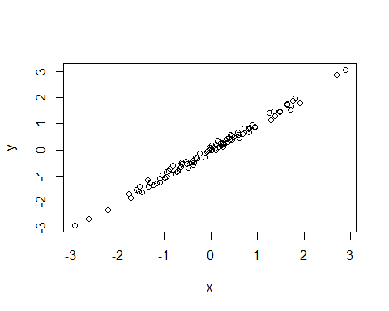
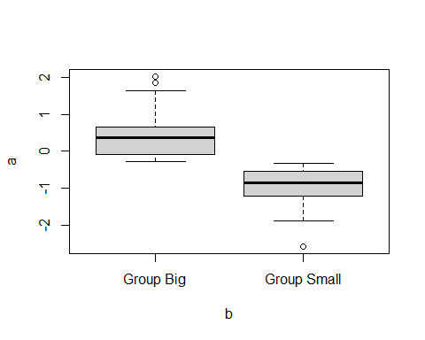

^1^ Max Planck Institute of Animal Behavior (MPIAB), Radolfzell, Germany

^2^ University of Life Sciences (CULS), Prague, Czech Republic

^3^ Blabla


`*` Corresponding author: kmorelle@ab.mpg.de


# ABSTRACT

Animal social behaviour is under focus since some decades. Integrating approach merging different field, like movement ecology, disease ecology and socio-biology are emerging over the last years. Yet, we feel there is still a gap in linking those approach within the landscape ecology field. Movement data are generally use for individuals or population level investigations, resource selection, habitat use, movement strategies. Yet these doesn't inform us about social whereabouts, e.g animals moving or spending time together. These area or patch or grid used by multiple animals simultaneously or with some short time lag are key for information and disease transfer in animal populations.  Although, it is slowly changing, We believe tracking data are still underexplored under the social prism. We proposed here a simple grid-based tool enabling to convert animal tracking data into social landscapes. This tool uses a set of metrics enabling to uncover the relative importance of landscape for direct and indirect social interactions. Specifically it enables to visualize social hubs where information or diseases can be transmitted within individuals. We apply this approach to a large dataset of GPS-tracked wild boar across Europe to make inference about landscape properties driving social interactions within this species carying concern in terms of disease transmission _+cheetah data from IZW?_, and illustrate how the proposed approach can potentially fill a missing gap in the movement-social and landscape scientific bubble. 


*Keywords*: Social hubs, interactions, aggregations, disease ecology, information, wild boar


# INTRODUCTION


# OBJECTIVE - RESEARCH QUESTIONS


# METHODS

## Data preparation

We used the Euroboar platform, which contains the largest European wild boar GPS tracking dataset (www.euroboar.org). Euroboar is part of the umbrella Eurommals inititiative whoch aims at...
The database contains *xxx* individuals GPS tracks across Europe. These data presents a wide variations in terms of sampling effort (i.e. number of locations per unit of time) and period (duration of tracking). For the present study we focus our investigations on those study areas in which multiple animals were simultaneously tracked. We extracted days in which 4 or more individuals were tracked and we resampled the tracks to one location every two hours. Our final dataset comprises *xx* study areas, *xx* individuals and *xxxxx* locations.
We considered as a *direct interactions* any simultaneous relocations between minimum two individuals within 5 minutes interval and maximum 50 meters apart distance. An *indirect interactions* was defined as the consecutive (in time) use of the same grid cell by one or more individuals. To assess whether an interaction took place between individuals of the same group (*within-group interaction*) or between individuals belonging to different groups (*between-groups interaction*), we computed a set of interactions patterns metrics at the dyadic level. Specifically, we calculated the following metrics: *homerange overlap*,*proximity index*, *coefficient of sociality*, *Half-weight association index* and *Correlation coefficient*. We classified dyads as belonging to the same group when **...**.

## Social interactions mapping

Application of a grid over your tracking data. Definition of a resolution. The decision on the resolution relies upon your species specific system and at which scale your are interested to observed interaction. Compromised between data resolution, species a priori knowledge of the social behaviour and scale of interest. To map social interaction over the landscape, we firstly deploy a grid over the tracking data. The grid resolution is a user-based parameter, which should be define according to the species of interest biological and ecological needs as well as to the research question. Within each of these grid we secondly calculated a set of metrics accounting for individuals / group of individuals direct and indirect interactions. The aim here is to elicit the relative value of the different landscape component (i.e. grid) in terms of social interactions (table *xxx*). As indirect metrics, we used the overal number of individuals having been observed in a grid cell , the frequency of grid visit and **...**. As direct metrics, we used the maximal and the mean number of simultaneously observed individuals, the duration of stay/visit in a grid and the mean inter-individuals distance. Within this calculation, we integrated the information on dyadic association (as described above) so that we could append to the observed (direct and indirect) interactions the level at which it took place, i.e. within or between groups.


::: {custom-style=""}

<caption>(\#tab:tbl_metrics)</caption>

:::

```{=openxml}
<w:tbl xmlns:w="http://schemas.openxmlformats.org/wordprocessingml/2006/main" xmlns:r="http://schemas.openxmlformats.org/officeDocument/2006/relationships" xmlns:w14="http://schemas.microsoft.com/office/word/2010/wordml" xmlns:wp="http://schemas.openxmlformats.org/drawingml/2006/wordprocessingDrawing" xmlns:a="http://schemas.openxmlformats.org/drawingml/2006/main" xmlns:pic="http://schemas.openxmlformats.org/drawingml/2006/picture" ><w:tblPr>NA"/><w:tblLayout w:type="fixed"/><w:jc w:val="center"/><w:tblW w:type="dxa" w:w="4320"/><w:tblLook w:firstRow="1" w:lastRow="0" w:firstColumn="0" w:lastColumn="0" w:noHBand="0" w:noVBand="1"/></w:tblPr><w:tblGrid><w:gridCol w:w="1080"/><w:gridCol w:w="1080"/><w:gridCol w:w="1080"/><w:gridCol w:w="1080"/></w:tblGrid><w:tr><w:trPr><w:cantSplit/><w:trHeight w:val="360" w:hRule="auto"/><w:tblHeader/></w:trPr><w:tc><w:tcPr><w:tcBorders><w:bottom w:val="single" w:sz="16" w:space="0" w:color="000000" /><w:top w:val="single" w:sz="16" w:space="0" w:color="000000" /></w:tcBorders><w:shd w:val="clear" w:color="auto" w:fill="FFFFFF"/><w:tcMar><w:top w:w="0" w:type="dxa"/><w:bottom w:w="0" w:type="dxa"/><w:left w:w="0" w:type="dxa"/><w:right w:w="0" w:type="dxa"/></w:tcMar><w:vAlign w:val="center"/></w:tcPr><w:p><w:pPr><w:jc w:val="left"/><w:spacing w:after="40" w:before="40" w:line="240"/><w:ind w:firstLine="0" w:left="100" w:right="100"/></w:pPr><w:r xmlns:w="http://schemas.openxmlformats.org/wordprocessingml/2006/main" xmlns:wp="http://schemas.openxmlformats.org/drawingml/2006/wordprocessingDrawing" xmlns:r="http://schemas.openxmlformats.org/officeDocument/2006/relationships" xmlns:w14="http://schemas.microsoft.com/office/word/2010/wordml"><w:rPr><w:rFonts w:ascii="Roboto" w:hAnsi="Roboto" w:eastAsia="Roboto" w:cs="Roboto"/><w:sz w:val="22"/><w:szCs w:val="22"/><w:color w:val="111111"/></w:rPr><w:t xml:space="preserve">Type</w:t></w:r></w:p></w:tc><w:tc><w:tcPr><w:tcBorders><w:bottom w:val="single" w:sz="16" w:space="0" w:color="000000" /><w:top w:val="single" w:sz="16" w:space="0" w:color="000000" /></w:tcBorders><w:shd w:val="clear" w:color="auto" w:fill="FFFFFF"/><w:tcMar><w:top w:w="0" w:type="dxa"/><w:bottom w:w="0" w:type="dxa"/><w:left w:w="0" w:type="dxa"/><w:right w:w="0" w:type="dxa"/></w:tcMar><w:vAlign w:val="center"/></w:tcPr><w:p><w:pPr><w:jc w:val="left"/><w:spacing w:after="40" w:before="40" w:line="240"/><w:ind w:firstLine="0" w:left="100" w:right="100"/></w:pPr><w:r xmlns:w="http://schemas.openxmlformats.org/wordprocessingml/2006/main" xmlns:wp="http://schemas.openxmlformats.org/drawingml/2006/wordprocessingDrawing" xmlns:r="http://schemas.openxmlformats.org/officeDocument/2006/relationships" xmlns:w14="http://schemas.microsoft.com/office/word/2010/wordml"><w:rPr><w:rFonts w:ascii="Roboto" w:hAnsi="Roboto" w:eastAsia="Roboto" w:cs="Roboto"/><w:sz w:val="22"/><w:szCs w:val="22"/><w:color w:val="111111"/></w:rPr><w:t xml:space="preserve">Metrics</w:t></w:r></w:p></w:tc><w:tc><w:tcPr><w:tcBorders><w:bottom w:val="single" w:sz="16" w:space="0" w:color="000000" /><w:top w:val="single" w:sz="16" w:space="0" w:color="000000" /></w:tcBorders><w:shd w:val="clear" w:color="auto" w:fill="FFFFFF"/><w:tcMar><w:top w:w="0" w:type="dxa"/><w:bottom w:w="0" w:type="dxa"/><w:left w:w="0" w:type="dxa"/><w:right w:w="0" w:type="dxa"/></w:tcMar><w:vAlign w:val="center"/></w:tcPr><w:p><w:pPr><w:jc w:val="left"/><w:spacing w:after="40" w:before="40" w:line="240"/><w:ind w:firstLine="0" w:left="100" w:right="100"/></w:pPr><w:r xmlns:w="http://schemas.openxmlformats.org/wordprocessingml/2006/main" xmlns:wp="http://schemas.openxmlformats.org/drawingml/2006/wordprocessingDrawing" xmlns:r="http://schemas.openxmlformats.org/officeDocument/2006/relationships" xmlns:w14="http://schemas.microsoft.com/office/word/2010/wordml"><w:rPr><w:rFonts w:ascii="Roboto" w:hAnsi="Roboto" w:eastAsia="Roboto" w:cs="Roboto"/><w:sz w:val="22"/><w:szCs w:val="22"/><w:color w:val="111111"/></w:rPr><w:t xml:space="preserve">Unit</w:t></w:r></w:p></w:tc><w:tc><w:tcPr><w:tcBorders><w:bottom w:val="single" w:sz="16" w:space="0" w:color="000000" /><w:top w:val="single" w:sz="16" w:space="0" w:color="000000" /></w:tcBorders><w:shd w:val="clear" w:color="auto" w:fill="FFFFFF"/><w:tcMar><w:top w:w="0" w:type="dxa"/><w:bottom w:w="0" w:type="dxa"/><w:left w:w="0" w:type="dxa"/><w:right w:w="0" w:type="dxa"/></w:tcMar><w:vAlign w:val="center"/></w:tcPr><w:p><w:pPr><w:jc w:val="left"/><w:spacing w:after="40" w:before="40" w:line="240"/><w:ind w:firstLine="0" w:left="100" w:right="100"/></w:pPr><w:r xmlns:w="http://schemas.openxmlformats.org/wordprocessingml/2006/main" xmlns:wp="http://schemas.openxmlformats.org/drawingml/2006/wordprocessingDrawing" xmlns:r="http://schemas.openxmlformats.org/officeDocument/2006/relationships" xmlns:w14="http://schemas.microsoft.com/office/word/2010/wordml"><w:rPr><w:rFonts w:ascii="Roboto" w:hAnsi="Roboto" w:eastAsia="Roboto" w:cs="Roboto"/><w:sz w:val="22"/><w:szCs w:val="22"/><w:color w:val="111111"/></w:rPr><w:t xml:space="preserve">Description</w:t></w:r></w:p></w:tc></w:tr><w:tr><w:trPr><w:cantSplit/><w:trHeight w:val="360" w:hRule="auto"/></w:trPr><w:tc><w:tcPr><w:vMerge w:val="restart"/><w:tcBorders></w:tcBorders><w:shd w:val="clear" w:color="auto" w:fill="FFFFFF"/><w:tcMar><w:top w:w="0" w:type="dxa"/><w:bottom w:w="0" w:type="dxa"/><w:left w:w="0" w:type="dxa"/><w:right w:w="0" w:type="dxa"/></w:tcMar><w:vAlign w:val="center"/></w:tcPr><w:p><w:pPr><w:jc w:val="left"/><w:spacing w:after="40" w:before="40" w:line="240"/><w:ind w:firstLine="0" w:left="100" w:right="100"/></w:pPr><w:r xmlns:w="http://schemas.openxmlformats.org/wordprocessingml/2006/main" xmlns:wp="http://schemas.openxmlformats.org/drawingml/2006/wordprocessingDrawing" xmlns:r="http://schemas.openxmlformats.org/officeDocument/2006/relationships" xmlns:w14="http://schemas.microsoft.com/office/word/2010/wordml"><w:rPr><w:rFonts w:ascii="Roboto" w:hAnsi="Roboto" w:eastAsia="Roboto" w:cs="Roboto"/><w:sz w:val="22"/><w:szCs w:val="22"/><w:color w:val="111111"/></w:rPr><w:t xml:space="preserve">indirect</w:t></w:r></w:p></w:tc><w:tc><w:tcPr><w:tcBorders></w:tcBorders><w:shd w:val="clear" w:color="auto" w:fill="FFFFFF"/><w:tcMar><w:top w:w="0" w:type="dxa"/><w:bottom w:w="0" w:type="dxa"/><w:left w:w="0" w:type="dxa"/><w:right w:w="0" w:type="dxa"/></w:tcMar><w:vAlign w:val="center"/></w:tcPr><w:p><w:pPr><w:jc w:val="left"/><w:spacing w:after="40" w:before="40" w:line="240"/><w:ind w:firstLine="0" w:left="100" w:right="100"/></w:pPr><w:r xmlns:w="http://schemas.openxmlformats.org/wordprocessingml/2006/main" xmlns:wp="http://schemas.openxmlformats.org/drawingml/2006/wordprocessingDrawing" xmlns:r="http://schemas.openxmlformats.org/officeDocument/2006/relationships" xmlns:w14="http://schemas.microsoft.com/office/word/2010/wordml"><w:rPr><w:rFonts w:ascii="Roboto" w:hAnsi="Roboto" w:eastAsia="Roboto" w:cs="Roboto"/><w:sz w:val="22"/><w:szCs w:val="22"/><w:color w:val="111111"/></w:rPr><w:t xml:space="preserve">n_ind</w:t></w:r></w:p></w:tc><w:tc><w:tcPr><w:tcBorders></w:tcBorders><w:shd w:val="clear" w:color="auto" w:fill="FFFFFF"/><w:tcMar><w:top w:w="0" w:type="dxa"/><w:bottom w:w="0" w:type="dxa"/><w:left w:w="0" w:type="dxa"/><w:right w:w="0" w:type="dxa"/></w:tcMar><w:vAlign w:val="center"/></w:tcPr><w:p><w:pPr><w:jc w:val="left"/><w:spacing w:after="40" w:before="40" w:line="240"/><w:ind w:firstLine="0" w:left="100" w:right="100"/></w:pPr><w:r xmlns:w="http://schemas.openxmlformats.org/wordprocessingml/2006/main" xmlns:wp="http://schemas.openxmlformats.org/drawingml/2006/wordprocessingDrawing" xmlns:r="http://schemas.openxmlformats.org/officeDocument/2006/relationships" xmlns:w14="http://schemas.microsoft.com/office/word/2010/wordml"><w:rPr><w:rFonts w:ascii="Roboto" w:hAnsi="Roboto" w:eastAsia="Roboto" w:cs="Roboto"/><w:sz w:val="22"/><w:szCs w:val="22"/><w:color w:val="111111"/></w:rPr><w:t xml:space="preserve">% of tracked individuals</w:t></w:r></w:p></w:tc><w:tc><w:tcPr><w:tcBorders></w:tcBorders><w:shd w:val="clear" w:color="auto" w:fill="FFFFFF"/><w:tcMar><w:top w:w="0" w:type="dxa"/><w:bottom w:w="0" w:type="dxa"/><w:left w:w="0" w:type="dxa"/><w:right w:w="0" w:type="dxa"/></w:tcMar><w:vAlign w:val="center"/></w:tcPr><w:p><w:pPr><w:jc w:val="left"/><w:spacing w:after="40" w:before="40" w:line="240"/><w:ind w:firstLine="0" w:left="100" w:right="100"/></w:pPr><w:r xmlns:w="http://schemas.openxmlformats.org/wordprocessingml/2006/main" xmlns:wp="http://schemas.openxmlformats.org/drawingml/2006/wordprocessingDrawing" xmlns:r="http://schemas.openxmlformats.org/officeDocument/2006/relationships" xmlns:w14="http://schemas.microsoft.com/office/word/2010/wordml"><w:rPr><w:rFonts w:ascii="Roboto" w:hAnsi="Roboto" w:eastAsia="Roboto" w:cs="Roboto"/><w:sz w:val="22"/><w:szCs w:val="22"/><w:color w:val="111111"/></w:rPr><w:t xml:space="preserve">total number of distinct individuals having visited a grid over a particular time frame</w:t></w:r></w:p></w:tc></w:tr><w:tr><w:trPr><w:cantSplit/><w:trHeight w:val="360" w:hRule="auto"/></w:trPr><w:tc><w:tcPr><w:vMerge/><w:tcBorders></w:tcBorders><w:shd w:val="clear" w:color="auto" w:fill="FFFFFF"/><w:tcMar><w:top w:w="0" w:type="dxa"/><w:bottom w:w="0" w:type="dxa"/><w:left w:w="0" w:type="dxa"/><w:right w:w="0" w:type="dxa"/></w:tcMar><w:vAlign w:val="center"/></w:tcPr><w:p><w:pPr><w:jc w:val="left"/><w:spacing w:after="40" w:before="40" w:line="240"/><w:ind w:firstLine="0" w:left="100" w:right="100"/></w:pPr></w:p></w:tc><w:tc><w:tcPr><w:tcBorders></w:tcBorders><w:shd w:val="clear" w:color="auto" w:fill="FFFFFF"/><w:tcMar><w:top w:w="0" w:type="dxa"/><w:bottom w:w="0" w:type="dxa"/><w:left w:w="0" w:type="dxa"/><w:right w:w="0" w:type="dxa"/></w:tcMar><w:vAlign w:val="center"/></w:tcPr><w:p><w:pPr><w:jc w:val="left"/><w:spacing w:after="40" w:before="40" w:line="240"/><w:ind w:firstLine="0" w:left="100" w:right="100"/></w:pPr><w:r xmlns:w="http://schemas.openxmlformats.org/wordprocessingml/2006/main" xmlns:wp="http://schemas.openxmlformats.org/drawingml/2006/wordprocessingDrawing" xmlns:r="http://schemas.openxmlformats.org/officeDocument/2006/relationships" xmlns:w14="http://schemas.microsoft.com/office/word/2010/wordml"><w:rPr><w:rFonts w:ascii="Roboto" w:hAnsi="Roboto" w:eastAsia="Roboto" w:cs="Roboto"/><w:sz w:val="22"/><w:szCs w:val="22"/><w:color w:val="111111"/></w:rPr><w:t xml:space="preserve">revisit_interval</w:t></w:r></w:p></w:tc><w:tc><w:tcPr><w:tcBorders></w:tcBorders><w:shd w:val="clear" w:color="auto" w:fill="FFFFFF"/><w:tcMar><w:top w:w="0" w:type="dxa"/><w:bottom w:w="0" w:type="dxa"/><w:left w:w="0" w:type="dxa"/><w:right w:w="0" w:type="dxa"/></w:tcMar><w:vAlign w:val="center"/></w:tcPr><w:p><w:pPr><w:jc w:val="left"/><w:spacing w:after="40" w:before="40" w:line="240"/><w:ind w:firstLine="0" w:left="100" w:right="100"/></w:pPr><w:r xmlns:w="http://schemas.openxmlformats.org/wordprocessingml/2006/main" xmlns:wp="http://schemas.openxmlformats.org/drawingml/2006/wordprocessingDrawing" xmlns:r="http://schemas.openxmlformats.org/officeDocument/2006/relationships" xmlns:w14="http://schemas.microsoft.com/office/word/2010/wordml"><w:rPr><w:rFonts w:ascii="Roboto" w:hAnsi="Roboto" w:eastAsia="Roboto" w:cs="Roboto"/><w:sz w:val="22"/><w:szCs w:val="22"/><w:color w:val="111111"/></w:rPr><w:t xml:space="preserve">every x hours</w:t></w:r></w:p></w:tc><w:tc><w:tcPr><w:tcBorders></w:tcBorders><w:shd w:val="clear" w:color="auto" w:fill="FFFFFF"/><w:tcMar><w:top w:w="0" w:type="dxa"/><w:bottom w:w="0" w:type="dxa"/><w:left w:w="0" w:type="dxa"/><w:right w:w="0" w:type="dxa"/></w:tcMar><w:vAlign w:val="center"/></w:tcPr><w:p><w:pPr><w:jc w:val="left"/><w:spacing w:after="40" w:before="40" w:line="240"/><w:ind w:firstLine="0" w:left="100" w:right="100"/></w:pPr><w:r xmlns:w="http://schemas.openxmlformats.org/wordprocessingml/2006/main" xmlns:wp="http://schemas.openxmlformats.org/drawingml/2006/wordprocessingDrawing" xmlns:r="http://schemas.openxmlformats.org/officeDocument/2006/relationships" xmlns:w14="http://schemas.microsoft.com/office/word/2010/wordml"><w:rPr><w:rFonts w:ascii="Roboto" w:hAnsi="Roboto" w:eastAsia="Roboto" w:cs="Roboto"/><w:sz w:val="22"/><w:szCs w:val="22"/><w:color w:val="111111"/></w:rPr><w:t xml:space="preserve">max number of individual simulatenously observed in a grid</w:t></w:r></w:p></w:tc></w:tr><w:tr><w:trPr><w:cantSplit/><w:trHeight w:val="360" w:hRule="auto"/></w:trPr><w:tc><w:tcPr><w:vMerge/><w:tcBorders></w:tcBorders><w:shd w:val="clear" w:color="auto" w:fill="FFFFFF"/><w:tcMar><w:top w:w="0" w:type="dxa"/><w:bottom w:w="0" w:type="dxa"/><w:left w:w="0" w:type="dxa"/><w:right w:w="0" w:type="dxa"/></w:tcMar><w:vAlign w:val="center"/></w:tcPr><w:p><w:pPr><w:jc w:val="left"/><w:spacing w:after="40" w:before="40" w:line="240"/><w:ind w:firstLine="0" w:left="100" w:right="100"/></w:pPr></w:p></w:tc><w:tc><w:tcPr><w:tcBorders></w:tcBorders><w:shd w:val="clear" w:color="auto" w:fill="FFFFFF"/><w:tcMar><w:top w:w="0" w:type="dxa"/><w:bottom w:w="0" w:type="dxa"/><w:left w:w="0" w:type="dxa"/><w:right w:w="0" w:type="dxa"/></w:tcMar><w:vAlign w:val="center"/></w:tcPr><w:p><w:pPr><w:jc w:val="left"/><w:spacing w:after="40" w:before="40" w:line="240"/><w:ind w:firstLine="0" w:left="100" w:right="100"/></w:pPr><w:r xmlns:w="http://schemas.openxmlformats.org/wordprocessingml/2006/main" xmlns:wp="http://schemas.openxmlformats.org/drawingml/2006/wordprocessingDrawing" xmlns:r="http://schemas.openxmlformats.org/officeDocument/2006/relationships" xmlns:w14="http://schemas.microsoft.com/office/word/2010/wordml"><w:rPr><w:rFonts w:ascii="Roboto" w:hAnsi="Roboto" w:eastAsia="Roboto" w:cs="Roboto"/><w:sz w:val="22"/><w:szCs w:val="22"/><w:color w:val="111111"/></w:rPr><w:t xml:space="preserve">visit_frequency</w:t></w:r></w:p></w:tc><w:tc><w:tcPr><w:tcBorders></w:tcBorders><w:shd w:val="clear" w:color="auto" w:fill="FFFFFF"/><w:tcMar><w:top w:w="0" w:type="dxa"/><w:bottom w:w="0" w:type="dxa"/><w:left w:w="0" w:type="dxa"/><w:right w:w="0" w:type="dxa"/></w:tcMar><w:vAlign w:val="center"/></w:tcPr><w:p><w:pPr><w:jc w:val="left"/><w:spacing w:after="40" w:before="40" w:line="240"/><w:ind w:firstLine="0" w:left="100" w:right="100"/></w:pPr><w:r xmlns:w="http://schemas.openxmlformats.org/wordprocessingml/2006/main" xmlns:wp="http://schemas.openxmlformats.org/drawingml/2006/wordprocessingDrawing" xmlns:r="http://schemas.openxmlformats.org/officeDocument/2006/relationships" xmlns:w14="http://schemas.microsoft.com/office/word/2010/wordml"><w:rPr><w:rFonts w:ascii="Roboto" w:hAnsi="Roboto" w:eastAsia="Roboto" w:cs="Roboto"/><w:sz w:val="22"/><w:szCs w:val="22"/><w:color w:val="111111"/></w:rPr><w:t xml:space="preserve">x by day/week/month</w:t></w:r></w:p></w:tc><w:tc><w:tcPr><w:tcBorders></w:tcBorders><w:shd w:val="clear" w:color="auto" w:fill="FFFFFF"/><w:tcMar><w:top w:w="0" w:type="dxa"/><w:bottom w:w="0" w:type="dxa"/><w:left w:w="0" w:type="dxa"/><w:right w:w="0" w:type="dxa"/></w:tcMar><w:vAlign w:val="center"/></w:tcPr><w:p><w:pPr><w:jc w:val="left"/><w:spacing w:after="40" w:before="40" w:line="240"/><w:ind w:firstLine="0" w:left="100" w:right="100"/></w:pPr><w:r xmlns:w="http://schemas.openxmlformats.org/wordprocessingml/2006/main" xmlns:wp="http://schemas.openxmlformats.org/drawingml/2006/wordprocessingDrawing" xmlns:r="http://schemas.openxmlformats.org/officeDocument/2006/relationships" xmlns:w14="http://schemas.microsoft.com/office/word/2010/wordml"><w:rPr><w:rFonts w:ascii="Roboto" w:hAnsi="Roboto" w:eastAsia="Roboto" w:cs="Roboto"/><w:sz w:val="22"/><w:szCs w:val="22"/><w:color w:val="111111"/></w:rPr><w:t xml:space="preserve"></w:t></w:r></w:p></w:tc></w:tr><w:tr><w:trPr><w:cantSplit/><w:trHeight w:val="360" w:hRule="auto"/></w:trPr><w:tc><w:tcPr><w:vMerge w:val="restart"/><w:tcBorders></w:tcBorders><w:shd w:val="clear" w:color="auto" w:fill="FFFFFF"/><w:tcMar><w:top w:w="0" w:type="dxa"/><w:bottom w:w="0" w:type="dxa"/><w:left w:w="0" w:type="dxa"/><w:right w:w="0" w:type="dxa"/></w:tcMar><w:vAlign w:val="center"/></w:tcPr><w:p><w:pPr><w:jc w:val="left"/><w:spacing w:after="40" w:before="40" w:line="240"/><w:ind w:firstLine="0" w:left="100" w:right="100"/></w:pPr><w:r xmlns:w="http://schemas.openxmlformats.org/wordprocessingml/2006/main" xmlns:wp="http://schemas.openxmlformats.org/drawingml/2006/wordprocessingDrawing" xmlns:r="http://schemas.openxmlformats.org/officeDocument/2006/relationships" xmlns:w14="http://schemas.microsoft.com/office/word/2010/wordml"><w:rPr><w:rFonts w:ascii="Roboto" w:hAnsi="Roboto" w:eastAsia="Roboto" w:cs="Roboto"/><w:sz w:val="22"/><w:szCs w:val="22"/><w:color w:val="111111"/></w:rPr><w:t xml:space="preserve">direct</w:t></w:r></w:p></w:tc><w:tc><w:tcPr><w:tcBorders></w:tcBorders><w:shd w:val="clear" w:color="auto" w:fill="FFFFFF"/><w:tcMar><w:top w:w="0" w:type="dxa"/><w:bottom w:w="0" w:type="dxa"/><w:left w:w="0" w:type="dxa"/><w:right w:w="0" w:type="dxa"/></w:tcMar><w:vAlign w:val="center"/></w:tcPr><w:p><w:pPr><w:jc w:val="left"/><w:spacing w:after="40" w:before="40" w:line="240"/><w:ind w:firstLine="0" w:left="100" w:right="100"/></w:pPr><w:r xmlns:w="http://schemas.openxmlformats.org/wordprocessingml/2006/main" xmlns:wp="http://schemas.openxmlformats.org/drawingml/2006/wordprocessingDrawing" xmlns:r="http://schemas.openxmlformats.org/officeDocument/2006/relationships" xmlns:w14="http://schemas.microsoft.com/office/word/2010/wordml"><w:rPr><w:rFonts w:ascii="Roboto" w:hAnsi="Roboto" w:eastAsia="Roboto" w:cs="Roboto"/><w:sz w:val="22"/><w:szCs w:val="22"/><w:color w:val="111111"/></w:rPr><w:t xml:space="preserve">n_ind_max</w:t></w:r></w:p></w:tc><w:tc><w:tcPr><w:tcBorders></w:tcBorders><w:shd w:val="clear" w:color="auto" w:fill="FFFFFF"/><w:tcMar><w:top w:w="0" w:type="dxa"/><w:bottom w:w="0" w:type="dxa"/><w:left w:w="0" w:type="dxa"/><w:right w:w="0" w:type="dxa"/></w:tcMar><w:vAlign w:val="center"/></w:tcPr><w:p><w:pPr><w:jc w:val="left"/><w:spacing w:after="40" w:before="40" w:line="240"/><w:ind w:firstLine="0" w:left="100" w:right="100"/></w:pPr><w:r xmlns:w="http://schemas.openxmlformats.org/wordprocessingml/2006/main" xmlns:wp="http://schemas.openxmlformats.org/drawingml/2006/wordprocessingDrawing" xmlns:r="http://schemas.openxmlformats.org/officeDocument/2006/relationships" xmlns:w14="http://schemas.microsoft.com/office/word/2010/wordml"><w:rPr><w:rFonts w:ascii="Roboto" w:hAnsi="Roboto" w:eastAsia="Roboto" w:cs="Roboto"/><w:sz w:val="22"/><w:szCs w:val="22"/><w:color w:val="111111"/></w:rPr><w:t xml:space="preserve">% of tracked individuals</w:t></w:r></w:p></w:tc><w:tc><w:tcPr><w:tcBorders></w:tcBorders><w:shd w:val="clear" w:color="auto" w:fill="FFFFFF"/><w:tcMar><w:top w:w="0" w:type="dxa"/><w:bottom w:w="0" w:type="dxa"/><w:left w:w="0" w:type="dxa"/><w:right w:w="0" w:type="dxa"/></w:tcMar><w:vAlign w:val="center"/></w:tcPr><w:p><w:pPr><w:jc w:val="left"/><w:spacing w:after="40" w:before="40" w:line="240"/><w:ind w:firstLine="0" w:left="100" w:right="100"/></w:pPr><w:r xmlns:w="http://schemas.openxmlformats.org/wordprocessingml/2006/main" xmlns:wp="http://schemas.openxmlformats.org/drawingml/2006/wordprocessingDrawing" xmlns:r="http://schemas.openxmlformats.org/officeDocument/2006/relationships" xmlns:w14="http://schemas.microsoft.com/office/word/2010/wordml"><w:rPr><w:rFonts w:ascii="Roboto" w:hAnsi="Roboto" w:eastAsia="Roboto" w:cs="Roboto"/><w:sz w:val="22"/><w:szCs w:val="22"/><w:color w:val="111111"/></w:rPr><w:t xml:space="preserve"></w:t></w:r></w:p></w:tc></w:tr><w:tr><w:trPr><w:cantSplit/><w:trHeight w:val="360" w:hRule="auto"/></w:trPr><w:tc><w:tcPr><w:vMerge/><w:tcBorders></w:tcBorders><w:shd w:val="clear" w:color="auto" w:fill="FFFFFF"/><w:tcMar><w:top w:w="0" w:type="dxa"/><w:bottom w:w="0" w:type="dxa"/><w:left w:w="0" w:type="dxa"/><w:right w:w="0" w:type="dxa"/></w:tcMar><w:vAlign w:val="center"/></w:tcPr><w:p><w:pPr><w:jc w:val="left"/><w:spacing w:after="40" w:before="40" w:line="240"/><w:ind w:firstLine="0" w:left="100" w:right="100"/></w:pPr></w:p></w:tc><w:tc><w:tcPr><w:tcBorders></w:tcBorders><w:shd w:val="clear" w:color="auto" w:fill="FFFFFF"/><w:tcMar><w:top w:w="0" w:type="dxa"/><w:bottom w:w="0" w:type="dxa"/><w:left w:w="0" w:type="dxa"/><w:right w:w="0" w:type="dxa"/></w:tcMar><w:vAlign w:val="center"/></w:tcPr><w:p><w:pPr><w:jc w:val="left"/><w:spacing w:after="40" w:before="40" w:line="240"/><w:ind w:firstLine="0" w:left="100" w:right="100"/></w:pPr><w:r xmlns:w="http://schemas.openxmlformats.org/wordprocessingml/2006/main" xmlns:wp="http://schemas.openxmlformats.org/drawingml/2006/wordprocessingDrawing" xmlns:r="http://schemas.openxmlformats.org/officeDocument/2006/relationships" xmlns:w14="http://schemas.microsoft.com/office/word/2010/wordml"><w:rPr><w:rFonts w:ascii="Roboto" w:hAnsi="Roboto" w:eastAsia="Roboto" w:cs="Roboto"/><w:sz w:val="22"/><w:szCs w:val="22"/><w:color w:val="111111"/></w:rPr><w:t xml:space="preserve">visit_duration</w:t></w:r></w:p></w:tc><w:tc><w:tcPr><w:tcBorders></w:tcBorders><w:shd w:val="clear" w:color="auto" w:fill="FFFFFF"/><w:tcMar><w:top w:w="0" w:type="dxa"/><w:bottom w:w="0" w:type="dxa"/><w:left w:w="0" w:type="dxa"/><w:right w:w="0" w:type="dxa"/></w:tcMar><w:vAlign w:val="center"/></w:tcPr><w:p><w:pPr><w:jc w:val="left"/><w:spacing w:after="40" w:before="40" w:line="240"/><w:ind w:firstLine="0" w:left="100" w:right="100"/></w:pPr><w:r xmlns:w="http://schemas.openxmlformats.org/wordprocessingml/2006/main" xmlns:wp="http://schemas.openxmlformats.org/drawingml/2006/wordprocessingDrawing" xmlns:r="http://schemas.openxmlformats.org/officeDocument/2006/relationships" xmlns:w14="http://schemas.microsoft.com/office/word/2010/wordml"><w:rPr><w:rFonts w:ascii="Roboto" w:hAnsi="Roboto" w:eastAsia="Roboto" w:cs="Roboto"/><w:sz w:val="22"/><w:szCs w:val="22"/><w:color w:val="111111"/></w:rPr><w:t xml:space="preserve">hours</w:t></w:r></w:p></w:tc><w:tc><w:tcPr><w:tcBorders></w:tcBorders><w:shd w:val="clear" w:color="auto" w:fill="FFFFFF"/><w:tcMar><w:top w:w="0" w:type="dxa"/><w:bottom w:w="0" w:type="dxa"/><w:left w:w="0" w:type="dxa"/><w:right w:w="0" w:type="dxa"/></w:tcMar><w:vAlign w:val="center"/></w:tcPr><w:p><w:pPr><w:jc w:val="left"/><w:spacing w:after="40" w:before="40" w:line="240"/><w:ind w:firstLine="0" w:left="100" w:right="100"/></w:pPr><w:r xmlns:w="http://schemas.openxmlformats.org/wordprocessingml/2006/main" xmlns:wp="http://schemas.openxmlformats.org/drawingml/2006/wordprocessingDrawing" xmlns:r="http://schemas.openxmlformats.org/officeDocument/2006/relationships" xmlns:w14="http://schemas.microsoft.com/office/word/2010/wordml"><w:rPr><w:rFonts w:ascii="Roboto" w:hAnsi="Roboto" w:eastAsia="Roboto" w:cs="Roboto"/><w:sz w:val="22"/><w:szCs w:val="22"/><w:color w:val="111111"/></w:rPr><w:t xml:space="preserve"></w:t></w:r></w:p></w:tc></w:tr><w:tr><w:trPr><w:cantSplit/><w:trHeight w:val="360" w:hRule="auto"/></w:trPr><w:tc><w:tcPr><w:vMerge/><w:tcBorders><w:bottom w:val="single" w:sz="16" w:space="0" w:color="000000" /></w:tcBorders><w:shd w:val="clear" w:color="auto" w:fill="FFFFFF"/><w:tcMar><w:top w:w="0" w:type="dxa"/><w:bottom w:w="0" w:type="dxa"/><w:left w:w="0" w:type="dxa"/><w:right w:w="0" w:type="dxa"/></w:tcMar><w:vAlign w:val="center"/></w:tcPr><w:p><w:pPr><w:jc w:val="left"/><w:spacing w:after="40" w:before="40" w:line="240"/><w:ind w:firstLine="0" w:left="100" w:right="100"/></w:pPr></w:p></w:tc><w:tc><w:tcPr><w:tcBorders><w:bottom w:val="single" w:sz="16" w:space="0" w:color="000000" /></w:tcBorders><w:shd w:val="clear" w:color="auto" w:fill="FFFFFF"/><w:tcMar><w:top w:w="0" w:type="dxa"/><w:bottom w:w="0" w:type="dxa"/><w:left w:w="0" w:type="dxa"/><w:right w:w="0" w:type="dxa"/></w:tcMar><w:vAlign w:val="center"/></w:tcPr><w:p><w:pPr><w:jc w:val="left"/><w:spacing w:after="40" w:before="40" w:line="240"/><w:ind w:firstLine="0" w:left="100" w:right="100"/></w:pPr><w:r xmlns:w="http://schemas.openxmlformats.org/wordprocessingml/2006/main" xmlns:wp="http://schemas.openxmlformats.org/drawingml/2006/wordprocessingDrawing" xmlns:r="http://schemas.openxmlformats.org/officeDocument/2006/relationships" xmlns:w14="http://schemas.microsoft.com/office/word/2010/wordml"><w:rPr><w:rFonts w:ascii="Roboto" w:hAnsi="Roboto" w:eastAsia="Roboto" w:cs="Roboto"/><w:sz w:val="22"/><w:szCs w:val="22"/><w:color w:val="111111"/></w:rPr><w:t xml:space="preserve">group_composition</w:t></w:r></w:p></w:tc><w:tc><w:tcPr><w:tcBorders><w:bottom w:val="single" w:sz="16" w:space="0" w:color="000000" /></w:tcBorders><w:shd w:val="clear" w:color="auto" w:fill="FFFFFF"/><w:tcMar><w:top w:w="0" w:type="dxa"/><w:bottom w:w="0" w:type="dxa"/><w:left w:w="0" w:type="dxa"/><w:right w:w="0" w:type="dxa"/></w:tcMar><w:vAlign w:val="center"/></w:tcPr><w:p><w:pPr><w:jc w:val="left"/><w:spacing w:after="40" w:before="40" w:line="240"/><w:ind w:firstLine="0" w:left="100" w:right="100"/></w:pPr><w:r xmlns:w="http://schemas.openxmlformats.org/wordprocessingml/2006/main" xmlns:wp="http://schemas.openxmlformats.org/drawingml/2006/wordprocessingDrawing" xmlns:r="http://schemas.openxmlformats.org/officeDocument/2006/relationships" xmlns:w14="http://schemas.microsoft.com/office/word/2010/wordml"><w:rPr><w:rFonts w:ascii="Roboto" w:hAnsi="Roboto" w:eastAsia="Roboto" w:cs="Roboto"/><w:sz w:val="22"/><w:szCs w:val="22"/><w:color w:val="111111"/></w:rPr><w:t xml:space="preserve">index 0-1, 1 = always same individuals/dyads/group, 0=always different</w:t></w:r></w:p></w:tc><w:tc><w:tcPr><w:tcBorders><w:bottom w:val="single" w:sz="16" w:space="0" w:color="000000" /></w:tcBorders><w:shd w:val="clear" w:color="auto" w:fill="FFFFFF"/><w:tcMar><w:top w:w="0" w:type="dxa"/><w:bottom w:w="0" w:type="dxa"/><w:left w:w="0" w:type="dxa"/><w:right w:w="0" w:type="dxa"/></w:tcMar><w:vAlign w:val="center"/></w:tcPr><w:p><w:pPr><w:jc w:val="left"/><w:spacing w:after="40" w:before="40" w:line="240"/><w:ind w:firstLine="0" w:left="100" w:right="100"/></w:pPr><w:r xmlns:w="http://schemas.openxmlformats.org/wordprocessingml/2006/main" xmlns:wp="http://schemas.openxmlformats.org/drawingml/2006/wordprocessingDrawing" xmlns:r="http://schemas.openxmlformats.org/officeDocument/2006/relationships" xmlns:w14="http://schemas.microsoft.com/office/word/2010/wordml"><w:rPr><w:rFonts w:ascii="Roboto" w:hAnsi="Roboto" w:eastAsia="Roboto" w:cs="Roboto"/><w:sz w:val="22"/><w:szCs w:val="22"/><w:color w:val="111111"/></w:rPr><w:t xml:space="preserve"></w:t></w:r></w:p></w:tc></w:tr></w:tbl>
```
We thirdly check for collinearity among our calculated metrics. We observed that **...**. 


## Steps 2: calculation of the metric at the grid level

## Steps 3: collinearity analysis

## Step 4: Modeling 

we used ML approach which are know oto more resistant to spatial autoregression [@Sabatinez2015]

From [@Meyer2018]
*Random forest algorithm Random Forest bases on the concept of regression and classification trees, i.e. a series of nested decision rules for the predictors that determine the response. It repeatedly builds trees from random samples of the training data with each tree is a separate model of the ensemble. The estimations of all trees are finally averaged to produce the final estimate (Breiman, 2001). To overcome correlation between trees, only a subset of predictors (mtry) is randomly selected at each split. The best predictor from the random subset is used at the respective split to partition the data. mtry is considered as a hyperparameter that needs to be tuned for a respective dataset in order to obtain an optimal trade-off between under- and over-fitting of the data. For a further description of Random Forest, see Breiman, 2001, James et al., 2013 and Kuhn and Johnson (2013). In this study, the Random Forest implementation of the randomForest package (Liaw and Wiener, 2002) in R was applied and accessed via the caret package (Kuhn, 2016). Throughout the study, each Random Forest model consisted of 500 trees after no increase of performance could be observed using a higher number of trees. mtry was tuned for each value between two and the respective number of predictor variables.*

# APPLICATIONS


Table: (\#tab:Table-Iris)A glimpse of the famous Iris dataset.

| Sepal.Length| Sepal.Width| Petal.Length| Petal.Width|Species |
|------------:|-----------:|------------:|-----------:|:-------|
|          5.1|         3.5|          1.4|         0.2|setosa  |
|          4.9|         3.0|          1.4|         0.2|setosa  |
|          4.7|         3.2|          1.3|         0.2|setosa  |
|          4.6|         3.1|          1.5|         0.2|setosa  |
|          5.0|         3.6|          1.4|         0.2|setosa  |
|          5.4|         3.9|          1.7|         0.4|setosa  |





# DISCUSSION

Discuss with other existing landscape-habitat available tools:

- Habitat network [@Peng2020]
- Grainscape toolbox
- Movescape [@BastilleRousseau2020]

Possible extension: multi-species, e.g. predator-prey interactions.

# CONCLUSIONS

Wrap up


# ACKNOWLEDGEMENTS

On the shoulders of giants.


# REFERENCES


###### Supplementary Table (on new page)


Table: (\#tab:Table-mtcars)Now a subset of mtcars dataset.

|                    |  mpg| cyl|  disp|  hp| drat|    wt|  qsec| vs| am| gear| carb|
|:-------------------|----:|---:|-----:|---:|----:|-----:|-----:|--:|--:|----:|----:|
|Merc 280            | 19.2|   6| 167.6| 123| 3.92| 3.440| 18.30|  1|  0|    4|    4|
|Merc 280C           | 17.8|   6| 167.6| 123| 3.92| 3.440| 18.90|  1|  0|    4|    4|
|Merc 450SE          | 16.4|   8| 275.8| 180| 3.07| 4.070| 17.40|  0|  0|    3|    3|
|Merc 450SL          | 17.3|   8| 275.8| 180| 3.07| 3.730| 17.60|  0|  0|    3|    3|
|Merc 450SLC         | 15.2|   8| 275.8| 180| 3.07| 3.780| 18.00|  0|  0|    3|    3|
|Cadillac Fleetwood  | 10.4|   8| 472.0| 205| 2.93| 5.250| 17.98|  0|  0|    3|    4|
|Lincoln Continental | 10.4|   8| 460.0| 215| 3.00| 5.424| 17.82|  0|  0|    3|    4|


###### Supplementary Figure (on new page)




